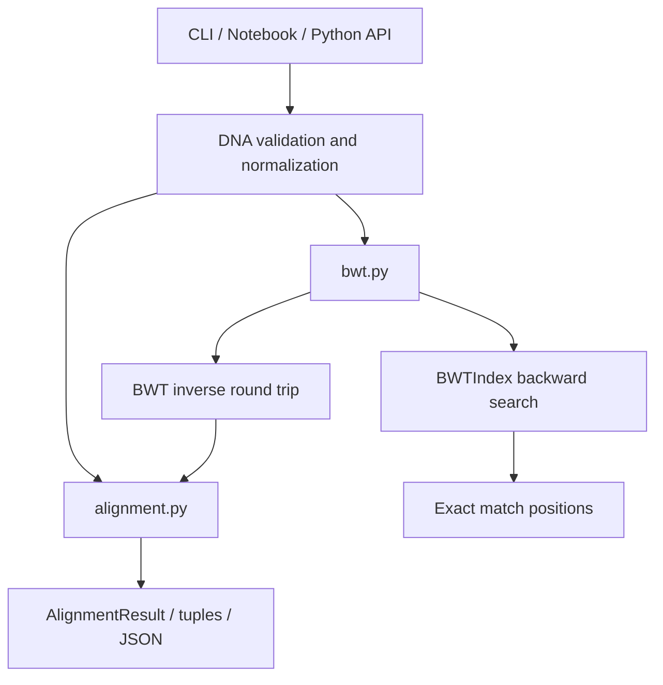

# Advanced DNA Sequence Analysis and Alignment Toolkit

Production-ready Python toolkit for DNA edit distance, local sequence alignment, reversible Burrows-Wheeler Transform (BWT) preprocessing, and exact pattern matching.

The project began as a single exploratory notebook. It is now organized as a tested package with a command-line interface, input validation, deterministic algorithms, and developer documentation.

## What It Does

| Capability | Implementation | Output |
| --- | --- | --- |
| Edit distance with gap runs | Dynamic programming with separate match, insertion, and deletion states | Minimum cost where the first gap in a run and consecutive gaps can have different costs |
| Local sequence alignment | Smith-Waterman with affine gap penalties | Score, aligned sequences, and source coordinates |
| Exact DNA pattern matching | BWT/FM-index style backward search | Sorted zero-based match positions |
| Reversible BWT preprocessing | Suffix array based BWT plus inverse transform | BWT string, suffix array, and original sequence recovery |
| Compression-aware alignment | BWT round-trip validation before Smith-Waterman alignment | Alignment after verifying the sequence was not corrupted |

## Repository Layout

```text
.
├── Advanced DNA Sequence Analysis and Alignment Toolkit.ipynb  # Notebook demo
├── README.md                                                   # Project guide
├── pyproject.toml                                              # Package metadata and CLI entry point
├── src/
│   └── dna_toolkit/
│       ├── alignment.py                                        # Edit distance and Smith-Waterman
│       ├── bwt.py                                              # BWT, inverse BWT, exact matching
│       ├── cli.py                                              # Command-line interface
│       └── validation.py                                       # DNA input validation
└── tests/
    ├── test_alignment.py
    ├── test_bwt.py
    └── test_cli.py
```

## Architecture



The package keeps user-facing entry points thin. All DNA strings are normalized to uppercase and checked against `A`, `C`, `G`, `T`, and `N` before algorithms run. The alignment module owns scoring logic. The BWT module owns reversible transform and exact matching logic. The CLI serializes these primitives without duplicating algorithm code.

## Requirements

- Python 3.9 or newer
- No runtime third-party dependencies
- Standard-library `unittest` for the included test suite

## Setup

Create and activate a virtual environment:

```bash
python3 -m venv .venv
source .venv/bin/activate
```

Install the package in editable mode:

```bash
python -m pip install --upgrade pip
python -m pip install -e .
```

Run the test suite:

```bash
python -m unittest discover -s tests -v
```

If you do not install the package, run commands with `PYTHONPATH=src`:

```bash
PYTHONPATH=src python -m unittest discover -s tests -v
```

## Command-Line Usage

After installation, use the `dna-toolkit` command. Without installation, replace `dna-toolkit` with `PYTHONPATH=src python -m dna_toolkit.cli`.

### Edit Distance

```bash
dna-toolkit edit-distance AAAA AA --gap-open 3 --gap-extend 1
```

Output:

```text
4
```

The cost is `3` for opening the deletion run plus `1` for extending it.

### Local Alignment

```bash
dna-toolkit align TTACGTAA GGACGTCC
```

Output:

```json
{
  "score": 12,
  "aligned_seq1": "ACGT",
  "aligned_seq2": "ACGT",
  "start_seq1": 2,
  "end_seq1": 6,
  "start_seq2": 2,
  "end_seq2": 6
}
```

### BWT Transform

```bash
dna-toolkit bwt GATTACA
```

Output:

```json
{
  "bwt": "ACTGA$TA",
  "suffix_array": [7, 6, 4, 1, 5, 0, 3, 2]
}
```

### Inverse BWT

```bash
dna-toolkit inverse-bwt 'ACTGA$TA'
```

Output:

```text
GATTACA
```

### Exact Pattern Matching

```bash
dna-toolkit match ATATAT ATA TAT GG
```

Output:

```json
{
  "ATA": [0, 2],
  "TAT": [1, 3],
  "GG": []
}
```

### Compression-Aware Alignment

```bash
dna-toolkit compressed-align TTACGTAA GGACGTCC
```

This command BWT-transforms sequence one, inverts it, verifies exact recovery, and only then performs Smith-Waterman alignment on the recovered biological sequence.

## Python API

```python
from dna_toolkit import (
    BWTIndex,
    edit_distance_with_gap_penalties,
    find_exact_matches,
    smith_waterman,
)

distance = edit_distance_with_gap_penalties(
    "AAAA",
    "AA",
    consecutive_gap_cost=1,
    isolated_gap_cost=3,
)

alignment = smith_waterman("TTACGTAA", "GGACGTCC")
matches = find_exact_matches("ATATAT", ["ATA", "TAT"])

index = BWTIndex.build("GATTACA")
positions = index.exact_match("TA")
```

## Scoring Model

| Function | Match | Mismatch | Gap opening | Gap extension |
| --- | ---: | ---: | ---: | ---: |
| `edit_distance_with_gap_penalties` | `0` cost | `mismatch_cost` | `isolated_gap_cost` | `consecutive_gap_cost` |
| `smith_waterman` | `match_score` | `mismatch_score` | `gap_open` | `gap_extend` |

Edit distance minimizes cost, so gap and mismatch values must be non-negative. Smith-Waterman maximizes score, so match must be positive while mismatch and gap penalties must be zero or negative.

## Algorithm Notes

- Edit distance uses three DP matrices so insertion and deletion gap runs are tracked independently. This fixes the ambiguity caused by a single boolean “previous gap” flag.
- Smith-Waterman traces back from the highest-scoring cell across all states, which is required for local alignment.
- BWT suffix arrays are built from sorted suffix indices, not `rotations.index(...)`, so repeated sequences are handled deterministically.
- Exact matching uses the BWT last column, first-occurrence table, and prefix count checkpoints to perform backward search.
- `smith_waterman_with_compression` treats BWT as reversible preprocessing. It does not align against the transformed BWT string because that string is not a biological sequence.

## Validation And Errors

Supported DNA symbols are:

| Symbol | Meaning |
| --- | --- |
| `A` | Adenine |
| `C` | Cytosine |
| `G` | Guanine |
| `T` | Thymine |
| `N` | Unknown or ambiguous nucleotide |

Whitespace is removed and lowercase input is normalized to uppercase. Any other symbol raises `ValueError`. The `$` sentinel is reserved internally by the BWT implementation and is rejected in user input.

## Testing

Run all tests:

```bash
PYTHONPATH=src python3 -m unittest discover -s tests -v
```

Current validated result:

```text
Ran 14 tests in 0.002s

OK
```

The tests cover:

- Edit distance gap-run costs and empty sequences
- Invalid scoring parameters
- Smith-Waterman local traceback from the true best cell
- Affine gap traceback
- Backward-compatible `hybrid_alignment` tuple API
- BWT transform stability with repeated suffixes
- Inverse BWT round trips
- Exact pattern matching positions
- CLI output for core commands

## Notebook

`Advanced DNA Sequence Analysis and Alignment Toolkit.ipynb` is a demonstration notebook. The tested implementation lives in `src/dna_toolkit`, so future algorithm changes should be made in the package and covered by tests rather than edited directly into notebook cells.

## Troubleshooting

| Problem | Fix |
| --- | --- |
| `ModuleNotFoundError: No module named 'dna_toolkit'` | Install with `python -m pip install -e .` or prefix commands with `PYTHONPATH=src`. |
| CLI command is unavailable | Re-run editable install in the active virtual environment. |
| `ValueError` about unsupported DNA symbols | Remove non-DNA characters or encode ambiguous bases as `N`. |
| BWT input rejects `$` | `$` is reserved as the unique sentinel and cannot appear in user sequences. |
| Alignment score is lower than expected | Check that penalties are signed correctly: edit distance uses positive costs, Smith-Waterman uses negative penalties. |

## Production Readiness Summary

This repository now has a clear package boundary, deterministic algorithms, input validation, a CLI, tests, and documentation. The implementation is appropriate for education, prototyping, and moderate-size sequence experiments. For very large genomes, replace the simple suffix-array builder with a linear or near-linear construction algorithm and add chunked/streaming IO around the CLI.

